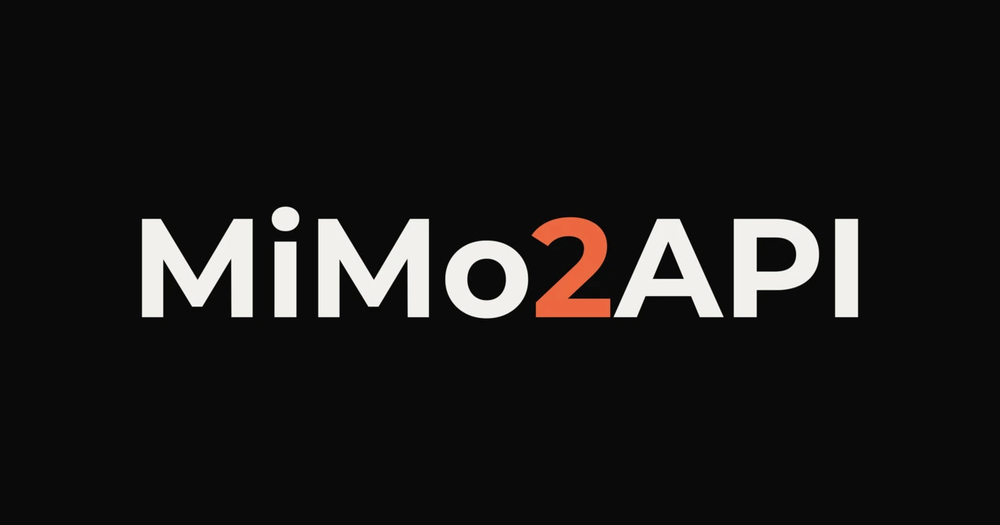

<div align="center">



# MiMo2API

[](https://www.gnu.org/licenses/gpl-3.0)
[](https://nodejs.org/)
[](https://www.typescriptlang.org/)
[](https://workers.cloudflare.com/)
[](https://github.com/XiaomiMiMo/MiMo-Code)
[](https://platform.openai.com/docs/api-reference)

<p align="center">
  OAuth to OpenAI-compatible API router for Xiaomi MiMo Code Desktop. Bridge OAuth credentials into a universal API gateway to unlock <b>Free Preview MiMo X models</b> (<code>MiMo-X-Pro-Preview</code> & <code>MiMo-X-Flash-Preview</code>) across <b>Claude Code, Codex, Antigravity, OpenCode and more</b>.
</p>

[Overview](#what-is-mimo2api) • [Features](#key-features) • [Quick Start](#quick-start) • [Models](#model-catalog--aliases) • [Clients](#client-integration) • [Architecture](#architecture--structure) • [Guides](#advanced-guides) • [Disclaimer](#disclaimer--legal-notice) • [License](#license)

</div>

## Table of Contents

- [What is MiMo2API?](#what-is-mimo2api)
- [Key Features](#key-features)
- [Quick Start](#quick-start)
  - [Method 1: Local Daemon](#method-1-local-daemon)
  - [Method 2: Cloudflare Workers (Serverless)](#method-2-cloudflare-workers-serverless)
- [Model Catalog & Aliases](#model-catalog--aliases)
- [Client Integration](#client-integration)
- [Architecture & Structure](#architecture--structure)
- [Advanced Guides](#advanced-guides)
  - [Multi-Account Pooling & 429 Failover](#multi-account-pooling--429-failover)
  - [Environment Variables](#environment-variables)
- [Development & Testing](#development--testing)
- [Disclaimer & Legal Notice](#disclaimer--legal-notice)
- [License](#license)

## What is MiMo2API?

In September 2026, Xiaomi introduced the **MiMo-X** model family (`MiMo-X-Pro-Preview` and `MiMo-X-Flash-Preview`), offering advanced reasoning, multi-agent coordination, and coding capabilities through invitation-based beta testing in the **Xiaomi MiMo Desktop** application.

However, access to these free preview quotas is locked behind Xiaomi's OAuth authentication inside the desktop client. Developers could not consume these models as standard OpenAI-compatible endpoints (`sk-...`) in external coding agents, harnesses, or IDEs.

**MiMo2API** bridges this gap:

1. It reads and manages Xiaomi OAuth tokens (`access_token` and `refresh_token`) from your local MiMo Desktop configuration (`auth.json`), proactively refreshing access tokens before expiration.
2. It serves a standard OpenAI-compatible endpoint (`/v1/chat/completions`, `/v1/models`, `/v1/health`) with full Server-Sent Events (SSE) streaming and `reasoning_content` delta preservation.
3. It supports both a zero-dependency **Local CLI Daemon** (`localhost:20128`) and a standalone **Cloudflare Worker** (`worker/worker.js`) with multi-account round-robin rotation and automatic 429 quota exhaustion fallback.

> **Disclaimer**: This tool is provided strictly for personal educational and interoperability testing purposes. Extracting or reusing OAuth credentials outside official desktop clients carries the risk of account suspension or ban. See [Disclaimer & Legal Notice](#disclaimer--legal-notice).

## Key Features

- **Unlock Free Preview Models**: Access `MiMo-X-Pro-Preview`, `MiMo-X-Flash-Preview`, and `mimo-v2.5` series models.
- **Dual Operational Modes**:
  - **Local Daemon**: Runs on `localhost:20128`, auto-detecting desktop credentials with zero configuration.
  - **Cloudflare Worker**: Standalone 20 KB bundle ready for copy-paste into Cloudflare Workers or Vercel Edge.
- **Multi-Account Round-Robin**: Pool multiple refresh tokens; requests distribute automatically across accounts.
- **Intelligent 429 Failover**: Automatically detects daily rate limits (`Daily free limit reached`, `Try again in...`), parks the exhausted account in cooldown, and retries the request transparently with the next available account.
- **Streaming SSE with Reasoning Delta**: Preserves thinking blocks in `delta.reasoning_content` for real-time rendering in coding assistants.
- **Safe & Resource-Bounded**:
  - Client disconnect cancellation via `AbortSignal` (prevents wasted quotas when cancelling prompts).
  - 120-second upstream timeout guards against stalled connections.
  - 10MB request payload limit protects against buffer exhaustion attacks.
  - Atomic token persistence using secure `0o600` file permissions.

## Quick Start

### Method 1: Local Daemon

#### Step 1: Verify Prerequisites

Install and log into the [Xiaomi MiMo Desktop](https://github.com/XiaomiMiMo/MiMo-Code) application. This saves your OAuth session in `auth.json`.

#### Step 2: Check Authentication

Test if your local credentials are detected:

```bash
npx mimo2api check
```

Or when running from a local clone:

```bash
npm run build
```

```bash
node dist/cli.js check
```

Example output:

```text
[MiMo2API] Checking local MiMo Desktop authentication...
Found configuration: C:\Users\<user>\AppData\Local\mimocode\data\auth.json
Found Xiaomi OAuth credentials:
  - Access Token: eyJhbGci... (1024 chars)
  - Refresh Token: dGhpcy1p... (256 chars)
  - Expires: 2026-09-18T23:59:00.000Z
Local authentication check passed!
```

#### Step 3: Start the Router

Run with default settings (port 20128, open access):

```bash
npx mimo2api start
```

Or specify a custom port:

```bash
npx mimo2api start --port 20128
```

Or enable optional API key authorization:

```bash
npx mimo2api start --port 20128 --key sk-my-secret-key
```

When running from source:

```bash
npm start
```

Your local endpoint is available at `http://localhost:20128/v1`.

### Method 2: Cloudflare Workers (Serverless)

Deploy a 24/7 serverless gateway without keeping your computer running.

#### Step 1: Copy the Code

Open [`worker/worker.js`](./worker/worker.js) and copy the entire file contents.

#### Step 2: Create Worker in Cloudflare Dashboard

1. Log into the [Cloudflare Dashboard](https://dash.cloudflare.com).
2. Go to **Workers & Pages** -> **Create application** -> **Create Worker**.
3. Set name to `mimo2api` and click **Deploy**.
4. Click **Edit code**, select all existing code, delete it, and paste the copied contents of `worker/worker.js`.
5. Click **Deploy** in the top right.

#### Step 3: Add Variables & Secrets

In your Worker, go to **Settings** -> **Variables and Secrets** and add:

| Variable | Type | Required | Description |
|---|---|---|---|
| `MIMO_REFRESH_TOKEN` | Secret | Yes | Your MiMo refresh token. Multi-account supported: one token per line. |
| `API_KEY` | Secret | Optional | Client bearer key (e.g. `sk-mimo-key`). |
| `UPSTREAM_BASE_URL` | Text | Optional | Upstream URL (defaults to `https://api.xiaomimimo.com/v1`). |

Click **Save and deploy**.

Your Cloudflare Worker API URL:

```
https://mimo2api.<your-subdomain>.workers.dev/v1
```

## Model Catalog & Aliases

MiMo2API automatically maps requested model aliases to canonical upstream models:

| Request Model Alias | Canonical Upstream Model | Description |
|---|---|---|
| `mimo-x-pro`, `mimo-x`, `gpt-4o` | `MiMo-X-Pro-Preview` | Advanced reasoning model for complex architectural coding |
| `mimo-x-flash`, `mimo-flash` | `MiMo-X-Flash-Preview` | Low-latency preview model for rapid edits and tool calls |
| `mimo-v2.5-pro`, `mimo-v2.5` | `mimo-v2.5-pro` | Xiaomi MiMo V2.5 base production model |
| `mimo-v2.5-flash` | `mimo-v2.5-flash` | Xiaomi MiMo V2.5 high-throughput model |

## Client Integration

<details>
<summary><b>9Router</b></summary>

Configuration file path:

```text
~/.9router/db.json
```

Or configure via Web Dashboard under **Providers** -> **Add Custom Provider**:

- Provider Type:

```text
openai
```

- Base URL:

```text
http://localhost:20128/v1
```

- API Key:

```text
sk-mimo
```

- Models:

```text
mimo-x-pro, mimo-x-flash
```

Configuration entry for `~/.9router/db.json`:

```json
{
  "providers": [
    {
      "id": "mimo2api",
      "name": "MiMo2API",
      "type": "openai",
      "baseUrl": "http://localhost:20128/v1",
      "apiKey": "sk-mimo",
      "models": [
        "mimo-x-pro",
        "mimo-x-flash"
      ]
    }
  ]
}
```

> Note: Both 9Router and MiMo2API default to port `20128`. When running both locally on the same host, start MiMo2API on a different port (e.g. `PORT=20129 npx mimo2api start`) and point 9Router to `http://localhost:20129/v1`, or point 9Router to your Cloudflare Worker URL.

</details>

<details>
<summary><b>Aider</b></summary>

Configuration file path:

```text
.aider.conf.yml
```

Add configuration:

```yaml
openai-api-base: http://localhost:20128/v1
openai-api-key: sk-mimo
model: openai/mimo-x-pro
```

</details>

<details>
<summary><b>Antigravity (AGY)</b></summary>

Configuration file path:

```text
~/.gemini/antigravity/antigravity.json
```

Add configuration:

```json
{
  "modelProviders": {
    "mimo2api": {
      "type": "openai",
      "baseUrl": "http://localhost:20128/v1",
      "apiKey": "sk-mimo",
      "defaultModel": "mimo-x-pro"
    }
  }
}
```

</details>

<details>
<summary><b>Cherry Studio</b></summary>

Configuration file path:

```text
~/.cherry-studio/config.json
```

Or configure via UI in **Settings** -> **Providers** -> **OpenAI**:

- Custom Server Address:

```text
http://localhost:20128/v1
```

- API Key:

```text
sk-mimo
```

- Models:

```text
mimo-x-pro
```

```text
mimo-x-flash
```

</details>

<details>
<summary><b>Claude Code</b></summary>

Configuration file path (Global):

```text
~/.claude/settings.json
```

Configuration file path (Project-level):

```text
.claude/settings.json
```

Add configuration:

```json
{
  "env": {
    "OPENAI_BASE_URL": "http://localhost:20128/v1",
    "OPENAI_API_KEY": "sk-mimo",
    "ANTHROPIC_MODEL": "mimo-x-pro"
  }
}
```

Then run:

```bash
claude
```

</details>

<details>
<summary><b>Cline</b></summary>

Configuration file path:

```text
.vscode/settings.json
```

Add configuration:

```json
{
  "cline.apiProvider": "openai-compatible",
  "cline.openAiBaseUrl": "http://localhost:20128/v1",
  "cline.openAiApiKey": "sk-mimo",
  "cline.openAiModelId": "mimo-x-pro"
}
```

</details>

<details>
<summary><b>Codex</b></summary>

Configuration file path:

```text
~/.codex/config.toml
```

Add configuration:

```toml
[model]
provider = "openai"
base_url = "http://localhost:20128/v1"
api_key = "sk-mimo"
model_name = "mimo-x-pro"
```

</details>

<details>
<summary><b>Continue.dev</b></summary>

Configuration file path:

```text
~/.continue/config.json
```

Add configuration:

```json
{
  "models": [
    {
      "title": "MiMo-X Pro Preview",
      "provider": "openai",
      "model": "mimo-x-pro",
      "apiBase": "http://localhost:20128/v1",
      "apiKey": "sk-mimo"
    }
  ]
}
```

</details>

<details>
<summary><b>Cursor</b></summary>

Configuration file path (Global):

```text
~/.cursor/User/settings.json
```

Configuration file path (Project-level):

```text
.vscode/settings.json
```

Add configuration:

```json
{
  "cursor.openaiBaseUrl": "http://localhost:20128/v1",
  "cursor.openaiApiKey": "sk-mimo",
  "cursor.model": "mimo-x-pro"
}
```

Or configure in **Cursor Settings** -> **Models**:

- Toggle **Override OpenAI Base URL**: `http://localhost:20128/v1`
- Set **OpenAI API Key**: `sk-mimo`
- Add model: `mimo-x-pro`

</details>

<details>
<summary><b>DeepSeek Harness</b></summary>

Configuration file path:

```text
agent.yaml
```

Add configuration:

```yaml
llm:
  api_type: openai
  base_url: "http://localhost:20128/v1"
  api_key: "sk-mimo"
  model: "mimo-x-pro"
  temperature: 0.7
```

</details>

<details>
<summary><b>Hermes</b></summary>

Configuration file path:

```text
~/.hermes/config.json
```

Add configuration:

```json
{
  "llm": {
    "provider": "openai",
    "baseUrl": "http://localhost:20128/v1",
    "apiKey": "sk-mimo",
    "model": "mimo-x-pro"
  }
}
```

</details>

<details>
<summary><b>LibreChat</b></summary>

Configuration file path:

```text
librechat.yaml
```

Add configuration:

```yaml
endpoints:
  custom:
    - name: "MiMo2API"
      apiKey: "sk-mimo"
      baseURL: "http://localhost:20128/v1"
      models:
        default: ["mimo-x-pro", "mimo-x-flash"]
      titleConvo: true
      modelDisplayLabel: "MiMo"
```

</details>

<details>
<summary><b>MiMo Code CLI</b></summary>

Configuration file path (Linux / macOS):

```text
~/.local/share/mimocode/mimocode.jsonc
```

Configuration file path (Windows):

```text
%LOCALAPPDATA%\mimocode\data\mimocode.jsonc
```

Add configuration:

```jsonc
{
  "providers": {
    "mimo2api": {
      "type": "openai-compatible",
      "baseUrl": "http://localhost:20128/v1",
      "apiKey": "sk-mimo",
      "models": [
        "mimo-x-pro",
        "mimo-x-flash"
      ]
    }
  },
  "default_model": "mimo2api/mimo-x-pro"
}
```

</details>

<details>
<summary><b>NextChat (ChatGPT-Next-Web)</b></summary>

Configuration file path:

```text
.env.local
```

Add configuration:

```env
BASE_URL=http://localhost:20128
OPENAI_API_KEY=sk-mimo
CUSTOM_MODELS=-all,+mimo-x-pro,+mimo-x-flash
```

</details>

<details>
<summary><b>OmniRoute</b></summary>

Configuration file path:

```text
~/.omniroute/providers.json
```

Add configuration via CLI:

```bash
omniroute provider add --id mimo2api --type openai --base-url http://localhost:20128/v1 --api-key sk-mimo --models mimo-x-pro,mimo-x-flash
```

Or add configuration to `~/.omniroute/providers.json`:

```json
{
  "providers": [
    {
      "id": "mimo2api",
      "name": "MiMo Preview Gateway",
      "type": "openai-compatible",
      "baseUrl": "http://localhost:20128/v1",
      "apiKey": "sk-mimo",
      "models": [
        "mimo-x-pro",
        "mimo-x-flash"
      ]
    }
  ]
}
```

</details>

<details>
<summary><b>OpenAI Compatible (Generic / SDKs)</b></summary>

Configuration file path:

```text
.env
```

Add environment configuration:

```env
OPENAI_BASE_URL="http://localhost:20128/v1"
OPENAI_API_KEY="sk-mimo"
```

Python SDK example:

```python
from openai import OpenAI

client = OpenAI(
    base_url="http://localhost:20128/v1",
    api_key="sk-mimo"
)

response = client.chat.completions.create(
    model="mimo-x-pro",
    messages=[{"role": "user", "content": "Write quicksort in Python."}],
    stream=True
)

for chunk in response:
    content = chunk.choices[0].delta.content or ""
    print(content, end="", flush=True)
```

Node.js SDK example:

```javascript
import OpenAI from "openai";

const client = new OpenAI({
  baseURL: "http://localhost:20128/v1",
  apiKey: "sk-mimo",
});

const response = await client.chat.completions.create({
  model: "mimo-x-pro",
  messages: [{ role: "user", content: "Write quicksort in TypeScript." }],
});

console.log(response.choices[0].message.content);
```

cURL command:

```bash
curl -X POST http://localhost:20128/v1/chat/completions \
  -H "Content-Type: application/json" \
  -H "Authorization: Bearer sk-mimo" \
  -d '{"model":"mimo-x-pro","messages":[{"role":"user","content":"Hello!"}]}'
```

</details>

<details>
<summary><b>OpenClaw</b></summary>

Configuration file path:

```text
openclaw.json
```

Add configuration:

```json
{
  "providers": {
    "mimo2api": {
      "type": "openai-compatible",
      "baseURL": "http://localhost:20128/v1",
      "apiKey": "sk-mimo",
      "models": [
        "mimo-x-pro",
        "mimo-x-flash",
        "mimo-v2.5-pro"
      ]
    }
  }
}
```

</details>

<details>
<summary><b>OpenCode</b></summary>

Configuration file path (Linux / macOS):

```text
~/.local/share/opencode/opencode.jsonc
```

Configuration file path (Project-level):

```text
opencode.jsonc
```

Add configuration:

```jsonc
{
  "providers": {
    "mimo2api": {
      "type": "openai-compatible",
      "baseUrl": "http://localhost:20128/v1",
      "apiKey": "sk-mimo",
      "models": [
        "mimo-x-pro",
        "mimo-x-flash"
      ]
    }
  },
  "default_model": "mimo2api/mimo-x-pro"
}
```

</details>

<details>
<summary><b>OpenHands (OpenDevin)</b></summary>

Configuration file path:

```text
config.toml
```

Add configuration:

```toml
[llm]
model = "openai/mimo-x-pro"
base_url = "http://localhost:20128/v1"
api_key = "sk-mimo"
```

</details>

<details>
<summary><b>Roo Code</b></summary>

Configuration file path:

```text
.vscode/settings.json
```

Add configuration:

```json
{
  "roo-cline.apiProvider": "openai-compatible",
  "roo-cline.openAiBaseUrl": "http://localhost:20128/v1",
  "roo-cline.openAiApiKey": "sk-mimo",
  "roo-cline.openAiModelId": "mimo-x-pro"
}
```

</details>

<details>
<summary><b>Trae (ByteDance Agentic IDE)</b></summary>

Configuration file path:

```text
~/.trae/config.json
```

Add configuration:

```json
{
  "modelProviders": [
    {
      "name": "MiMo2API",
      "apiType": "openai",
      "endpoint": "http://localhost:20128/v1",
      "apiKey": "sk-mimo",
      "models": [
        "mimo-x-pro",
        "mimo-x-flash"
      ]
    }
  ]
}
```

</details>

<details>
<summary><b>Windsurf</b></summary>

Configuration file path:

```text
~/.codeium/windsurf/model_config.json
```

Add configuration:

```json
{
  "customOpenAI": {
    "endpoint": "http://localhost:20128/v1",
    "apiKey": "sk-mimo",
    "model": "mimo-x-pro"
  }
}
```

</details>

## Architecture & Structure

```
MiMo2API/
├── src/
│   ├── types/
│   │   ├── auth.ts              # OAuth credentials, pool states, refresh contracts
│   │   ├── openai.ts            # OpenAI request/response/SSE schemas & chunk deltas
│   │   └── config.ts            # Server and Cloudflare Worker runtime configuration
│   ├── auth/
│   │   ├── token-store.ts       # Discovers and parses local auth.json with atomic writes
│   │   ├── oauth-client.ts      # Xiaomi OAuth 2.0 exchange & proactive TTL refresh
│   │   └── pool-manager.ts      # Multi-account round-robin pool with 429 cooldown backoff
│   ├── proxy/
│   │   ├── model-catalog.ts     # Model list & alias normalizer (mimo-x-pro -> MiMo-X-Pro-Preview)
│   │   ├── stream-transformer.ts# Real-time SSE transformer with reasoning_content support
│   │   └── completion-handler.ts# Core completion proxy with cancellation & failover retry
│   ├── server/
│   │   ├── routes.ts            # Route dispatcher (/v1/models, /v1/chat/completions, /v1/health)
│   │   └── http-server.ts       # Native Node.js 22 HTTP server with graceful shutdown
│   ├── cli/
│   │   └── index.ts             # CLI entrypoint (start, check)
│   └── worker/
│       └── index.ts             # Cloudflare Workers / Vercel Edge fetch entrypoint
├── worker/
│   └── worker.js                # Standalone zero-dependency Cloudflare Worker bundle (20 KB)
├── dist/
│   └── cli.js                   # Standalone Node.js CLI executable bundle (29 KB)
├── tests/                       # 36 automated unit & integration tests
├── scripts/
│   └── build.ts                 # esbuild build pipeline
├── package.json
└── tsconfig.json
```

## Advanced Guides

### Multi-Account Pooling & 429 Failover

If an account reaches its preview quota limit, MiMo2API automatically shifts traffic to the next account without interrupting your active session.

In Cloudflare Workers or your local environment, pass multiple refresh tokens separated by newlines in `MIMO_REFRESH_TOKEN`:

```env
MIMO_REFRESH_TOKEN="token_account_1
token_account_2
token_account_3"
```

**Workflow**:

1. **Round-Robin**: Requests cycle across active accounts to distribute load.
2. **Quota Detection**: When an account encounters HTTP 429 (`Daily free limit reached` or `Try again in 2h 30m`), the router parses the duration and parks that account in cooldown.
3. **Transparent Retry**: The current request is immediately retried using the next available account in the pool.
4. **Health Diagnostics**: Query `/v1/health` to monitor active versus cooldown accounts.

### Environment Variables

| Variable | Mode | Default | Description |
|---|---|---|---|
| `PORT` | Local | `20128` | Local HTTP daemon port |
| `HOST` | Local | `127.0.0.1` | Local bind address |
| `API_KEY` | Both | *(None)* | Client authorization bearer token |
| `MIMO_REFRESH_TOKEN` | Both | *(From auth.json)* | Newline-separated list of refresh tokens |
| `MIMOCODE_HOME` | Local | *(Auto)* | Custom directory to look for `auth.json` |
| `UPSTREAM_BASE_URL` | Both | `https://api.xiaomimimo.com/v1` | Upstream MiMo inference endpoint |
| `OAUTH_TOKEN_URL` | Both | `https://account.xiaomi.com/oauth2/token` | Upstream Xiaomi OAuth token endpoint |

## Development & Testing

Run typecheck:

```bash
npm run typecheck
```

Run automated test suite:

```bash
npm test
```

Build standalone bundles:

```bash
npm run build
```

## Disclaimer & Legal Notice

> **IMPORTANT**: Please read this notice carefully before using or deploying MiMo2API.

1. **Educational & Research Purposes Only**: This project is developed and distributed exclusively for personal educational, research, and non-commercial API interoperability testing purposes.
2. **Risk of Account Suspension or Ban**: Extracting OAuth tokens, managing session credentials, or routing automated API requests outside the official Xiaomi MiMo Desktop client may violate Xiaomi's Terms of Service and End User License Agreements. Xiaomi may rate-limit, revoke tokens for, suspend, or permanently ban your Xiaomi account without prior warning.
3. **No Warranty & No Guarantee**: The author and contributors make no claims, promises, or guarantees regarding the safety, status, or longevity of your Xiaomi account. This software is provided "AS IS", without warranty of any kind, express or implied.
4. **Assumption of Risk**: You assume full and sole responsibility for any outcomes or damages resulting from using this software, including but not limited to account termination, loss of API access, or data loss. Use strictly at your own risk.
5. **Trademark Attribution**: All product names, logos, and brands (such as "Xiaomi", "MiMo", "MiMo-Code") are trademarks or registered trademarks of their respective owners (Xiaomi Inc.). MiMo2API is an independent open-source project and is neither affiliated with, maintained by, nor endorsed by Xiaomi Inc.

## License

This project is licensed under the **GNU General Public License v3.0 (GPLv3)**. See the [LICENSE](./LICENSE) file for details.
