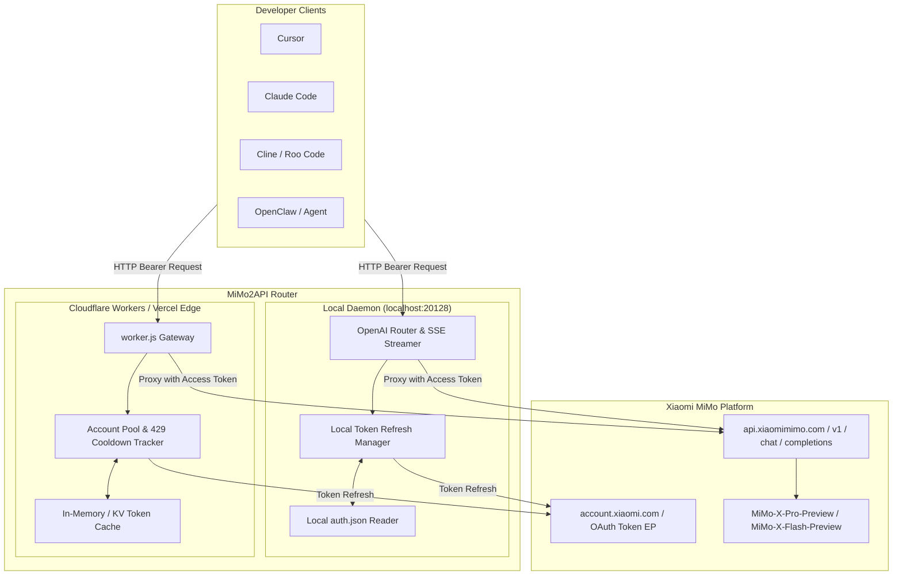

# MiMo2API · Technical Architecture & Protocol Specification

## 1. System Overview

`MiMo2API` bridges Xiaomi MiMo Desktop OAuth authentication into a universal, OpenAI-compatible REST API gateway. It provides two operational targets:
1. **Local Mode (`mimo2api-local`)**: Zero-dependency or lightweight Node.js/TypeScript daemon running on `localhost:20128`. Automatically reads/updates tokens from local MiMo Desktop configuration (`auth.json`).
2. **Serverless Mode (`mimo2api-worker`)**: Single-file Cloudflare Worker / Vercel Edge script (`worker.js`). Takes a list of refresh tokens via `MIMO_REFRESH_TOKEN`, performs token exchange, caches access tokens, and rotates accounts on 429 quota exhaustion.



---

## 2. Authentication & Credential Mechanics

### 2.1 Local `auth.json` Storage
MiMo Code stores authenticated session data at:
- **Windows**: `%LOCALAPPDATA%\mimocode\auth.json` (or `%LOCALAPPDATA%\mimocode\data\auth.json`)
- **Linux/macOS**: `~/.local/share/mimocode/auth.json`

Structure:
```json
{
  "xiaomi": {
    "type": "oauth",
    "access_token": "...",
    "refresh_token": "...",
    "expires_at": 1758234567000
  }
}
```

### 2.2 Token Refresh Lifecycle
1. **TTL Check**: Before proxying any `/v1/chat/completions` request, inspect cached `access_token` timestamp. If expired or expires within 300 seconds:
2. **Refresh Call**:
   ```http
   POST https://account.xiaomi.com/oauth2/token
   Content-Type: application/x-www-form-urlencoded

   grant_type=refresh_token&client_id=<CLIENT_ID>&refresh_token=<REFRESH_TOKEN>
   ```
3. **Response Handling**:
   - On `200 OK`: Update memory cache and write back to `auth.json` (in Local mode).
   - On `400/401 Bad Token`: Mark account invalid in pool; if all accounts fail, return HTTP 401 upstream error.

---

## 3. Account Pooling & Multi-Account Rotation (Cloudflare Worker)

### 3.1 Environment Variables & Secrets
- `MIMO_REFRESH_TOKEN`: Multi-line string containing one refresh token per line.
- `API_KEY`: Custom secret key required from client requests (`Authorization: Bearer <API_KEY>`). If not set, defaults to open / permissive dev mode.

### 3.2 Cooldown & Failover Algorithm
1. **Account Selection**: Round-robin pointer iterating through active accounts.
2. **Cooldown State**:
   ```typescript
   interface AccountState {
     refreshToken: string;
     accessToken?: string;
     expiresAt: number;
     cooldownUntil: number;
     failureCount: number;
   }
   ```
3. **429 Handling**:
   - If upstream responds with HTTP 429 (e.g. `Daily free limit reached`, `Quota exhausted`), inspect `Retry-After` header or parse message for wait duration (defaulting to 1 hour if unspecified).
   - Set `cooldownUntil = Date.now() + cooldownMs`.
   - Immediately switch to next eligible account and retry the request transparently.
   - If all accounts are in cooldown, return the upstream 429 payload to client.

---

## 4. Model Catalog & Mapping

| Exposed Model Name | Aliases | Upstream Target ID | Characteristics |
|---|---|---|---|
| `mimo-x-pro` | `MiMo-X-Pro-Preview`, `mimo-x`, `gpt-4o` | `MiMo-X-Pro-Preview` | High-reasoning preview model, long-context programming |
| `mimo-x-flash` | `MiMo-X-Flash-Preview`, `mimo-flash` | `MiMo-X-Flash-Preview` | Low-latency coding & tool-calling preview model |
| `mimo-v2.5-pro` | `mimo-v2.5` | `mimo-v2.5-pro` | V2.5 production release base model |
| `mimo-v2.5-flash` | `mimo-v2.5-flash` | `mimo-v2.5-flash` | V2.5 high-throughput model |

---

## 5. Streaming (SSE) Protocol Passthrough

To ensure real-time response rendering in Cursor, Claude Code, and other coding tools:
- Gateway proxies upstream chunks using `text/event-stream`.
- Upstream reasoning/thinking blocks (if present in `reasoning_content`) are preserved and transformed into standard OpenAI thinking chunk delta extensions (`delta.reasoning_content`).
- Headers:
  - `Content-Type: text/event-stream; charset=utf-8`
  - `Cache-Control: no-cache`
  - `Connection: keep-alive`
